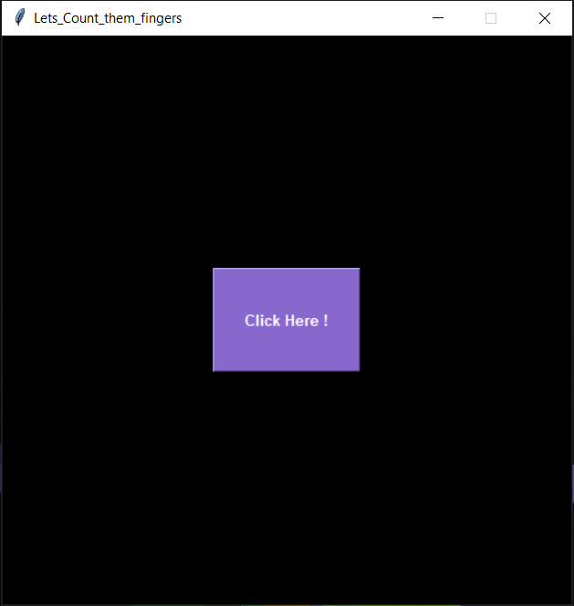
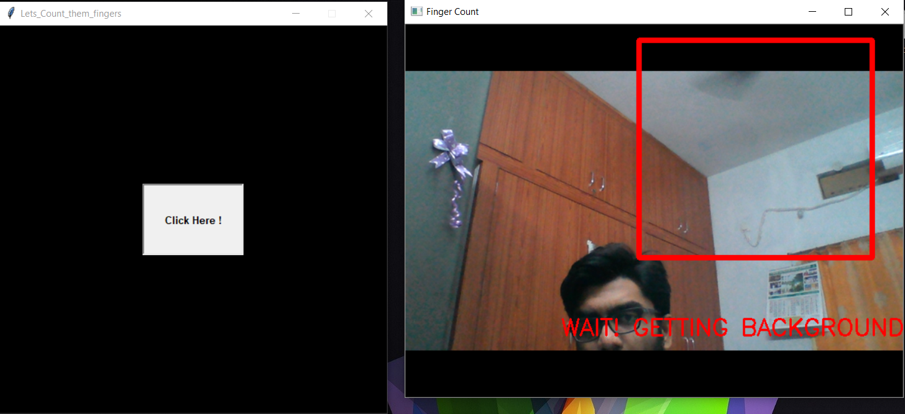
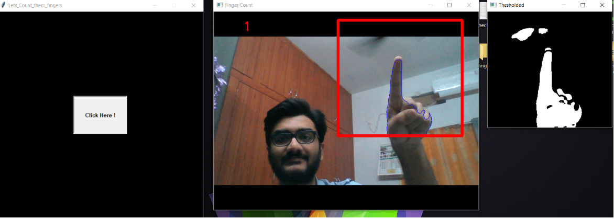
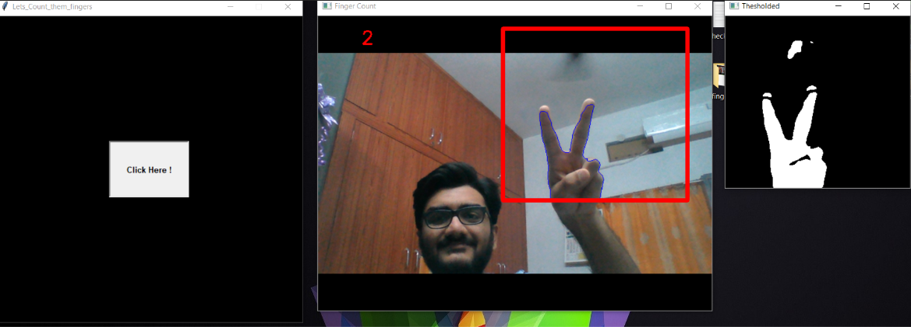
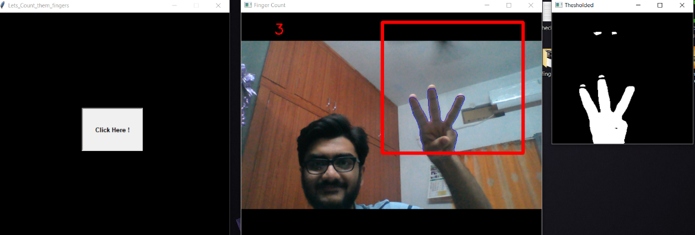
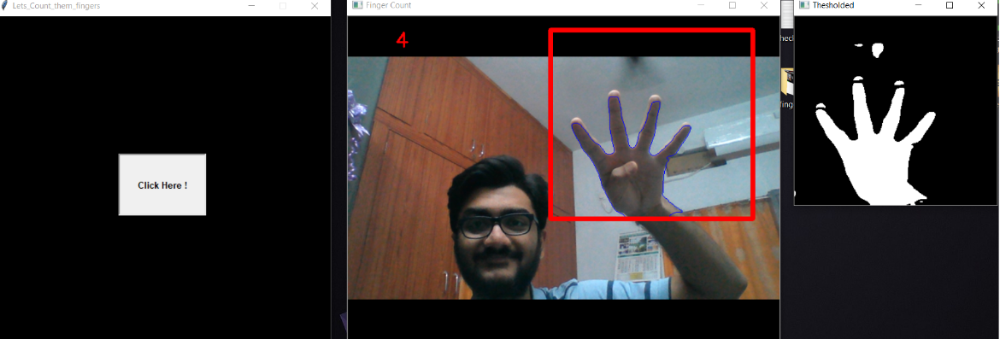
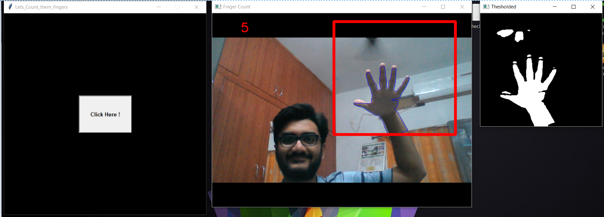

# Lets_Count_them_fingers

A simple GUI program to detect and count the no.of fingers shown

---------------------------------------------------------------------------------------------------------------------------------------

# Simple GUI

----------------------------------------------------------------------------------------------------------------------------------------

# This step allows the user to make sure that there are no obstructions/noise and gives a time of 30 frames to adjust your hand into       the ROI {Region Of Interest}

---------------------------------------------------------------------------------------------------------------------------------------

# 1

----------------------------------------------------------------------------------------------------------------------------------------

# 2

----------------------------------------------------------------------------------------------------------------------------------------

# 3

----------------------------------------------------------------------------------------------------------------------------------------

# 4

----------------------------------------------------------------------------------------------------------------------------------------

# 5

----------------------------------------------------------------------------------------------------------------------------------------

---------------------------------------------------------------------------------------------------------
code inspired from jose Portilla
